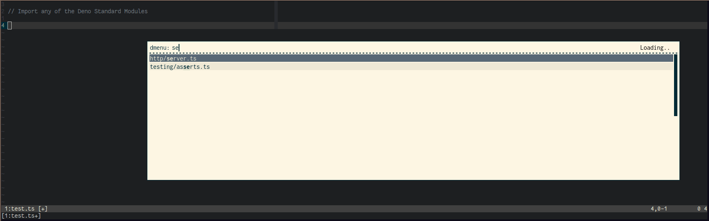

# pickYourEsModule

browse and pick your ECMAScript Modules

Fits perfectly to [Deno](https://deno.land/), e.g. for picking one of the Deno
Standard Modules and importing directly from the URL.

## Get the ES Modules

With the help of the `selectModule.sh` bash script you can pick any **ES
Module** with your favorite _selection app_, e.g. `rofi` or `dmenu`.

The `DIR` variable or the first _positional parameter_ defines the path where
the script looks for ES modules.  
If you have `rofi` installed, start the `selectModule.sh` script and all files
which include ES modules are displayed one below the other.  
After you selected a file, the Shell script calls the JavaScript script
`getEsModules.js` to display all ESM exports.

When you select an export, the script will automatically copy a string - like
the following one - into your clipboard:

`import { serve } from "https://deno.land/std/http/server.ts";`

You can import the module with the copied string immediately.

## Dependencies

To use the `selectModule.sh` script you need `xclip` or `xsel` and `rofi` or
`dmenu`.
