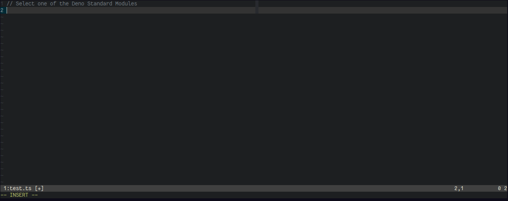

# pickYourEsModule

browse and pick your ECMAScript Modules - only for Linux.

This script fits perfectly to [Deno](https://deno.land/). For example, you can
choose one of the Deno Standard Modules and then import it directly with the URL
which has been copied into your clipboard.

## Quick Start

If you want to use this script for _browsing_ through all the `deno_std` ES
Modules run `./selectModule.sh <path>` where `<path>` is the location of the
`deno_std` [repository](https://github.com/denoland/deno_std) on your device.

When you select an ES Module, the script will automatically copy a string - like
the following one - into your clipboard:

`import { serve } from "https://deno.land/std/http/server.ts";`

## Arguments

1. A path to a directory with containes files with ES Modules.
2. An optional base URL. The default is: `https://deno.land/std`.
3. Keep or remove git tags from URL wit `-f`.
4. Optional deno options: For example: `--quiet`.

## Dependencies

`pickYourEsModule` consists of the two files `selectModule.sh` and
`getEsModules.js` which have to be in the same directory.

Furthermore it depends on `xclip` or `xsel` and `rofi` or `dmenu`.
